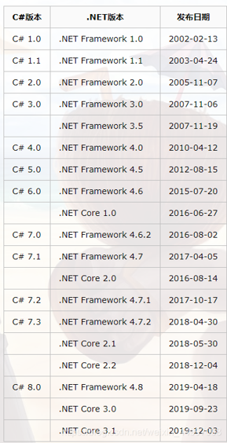
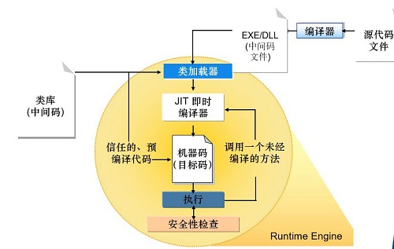

##                                          本节目标

1. 了解.NET Framework是什么？

## .NET 平台

Microsoft.NET是一个软件开发和服务平台，2000年6月22日微软发布，目的是向全世界的客户提供强大的、个性化的互联网服务。

.NET Framework  和 .NET Core 是.NET 平台最重要的两个框架。

.NET Framework  是 Windows 中的一个组件，只能运行于Windows系统中。

.NET Core 实现了跨平台,可以在多个操作系统中安装使用，例如在 Mac、Linux 等。

## .NET Framework

.NET Framework 是一个可以快速开发、部署网站服务及应用程序的开发平台，是 Windows 中的一个组件，包括公共语言运行时（Common Language Runtime, CLR）虚拟执行系统和 .NET Framework 类库。

提供优化的代码执行环境，具有良好的版本兼容性，并允许在同一台计算机上安装不同版本的 .NET Framework。
使用 JIT（Just In Time）技术，提高代码的运行速度。，

## .NET Framework的体系结构

 .NET Framework 体系结构:

1. 编程语言:
	在 .NET Framework 框架中支持的编程语言包括 C#、VB、C++、javaScript、Python 等， 但目前使用最多的是 C# 语言。

	正是由于在 .NET Framework 中支持多种编程语言，因此 .NET Framework 也配备了对应的编译器。
	
2. .NET Framework 类库（Framework Class Library, FCL）
	在 FCL 中包括 Windows Forms （Windows 窗体程序）、ASP.NET（网站程序）、WPF（Windows 的界面程序的框架）、 WCF（Windows 平台上的工作流程序）等程序所用到的类库文件。

3. CTS(Common Type System):通用类型系统；
	定义了一套可以在中间语言中使用的预定义数据类型，所有面向.NET Framework语言最终基于这些类型的编译代码。
	用于解决不同编程语言的数据类型不同的问题。为跨语言的实现做出了重大贡献。
	
4. 	CLS(Common Language Specification): 公共语言运行规范;
	定义了一个最小功能集，任何一种语言的编译器都支持此集，使所有的语言能够互相使用符合规范的功能。

5. CLR(Common Language Runtime):公共语言运行时；
	CLR 是 .NET Framework 的基础。用户可以将 CLR 看作一个在执行时管理代码的代码，它提供内存管理、线程管理和远程处理等核心服务，并且还强制实施严格类型安全以及可提高安全性和可靠性的管理。

	它与 Java 虚拟机类似。以公共语言运行库为目标的代码称为托管代码，不以公共语言运行库为目标的代码称为非托管代码。

## .NET 程序编译原理

 

1. 用编程语言编写代码的文件成为源文件，C#的源文件以cs后缀名结尾；
2. 将源程序编译成中间语言（IL），以程序集存在，CPU不执行中间代码的程序集；
3. 在执行代码时，使用公共语言运行时的即时编译器（JIT）将中间代码编译为本机的机器码；
4. 在托管的CLR环境下运行机器代码。

## .NET Framework类库

.NET Framework实现了应用程序开发的“通用性”，所有的编程语言均使用统一的基础类库。

.NET Framework中，所有的命名空间都是从System的命名空间形成的，System命名空间又称为根命名空间。

|命名空间|描述|
|----|----|
|System.Web|提供可使浏览器与服务器通信的类和接口|
|System.Data|处理数据存储和管理，在ADO.net中扮演重要角色|
|System.IO|管理对文件和流的操作|
|System.Threading|包含用于多线程编程的类|
|System.Collection.Generic	|包含定义泛型集合的接口和类|
|System.Collections	|包含定义各种对象集合的接口和类|
|System.Windows.Forms	|包含用于开发Windows窗体应用程序的控件和类|
|System.Net	|对网络协议进行编程|

## .NET Framework的优点

1. 统一的编程模型
2. 极大的简化了应用程序的开发和部署
3. 健壮和安全的执行环境
4. 支持多种编程语言

