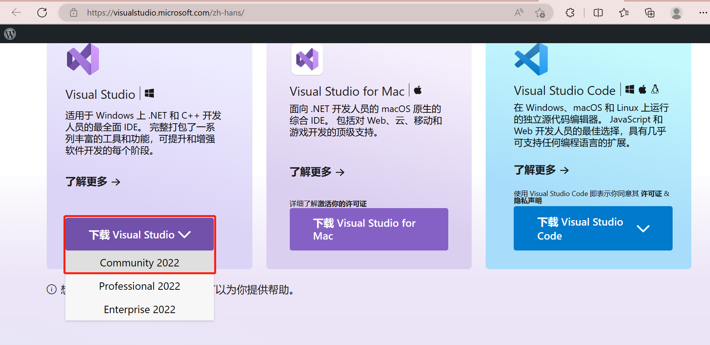
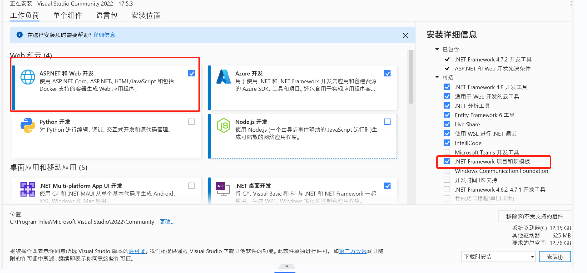
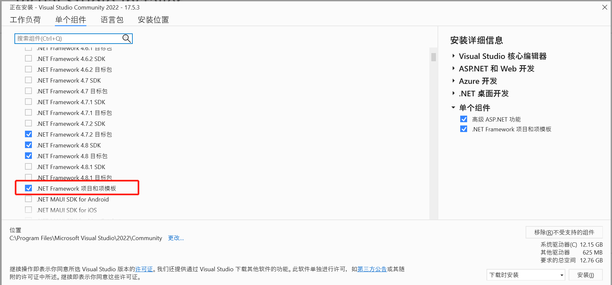

## 本节目标

1. 安装Visual Studio 2022

## Visual Studio 
Visual Studio是专门的一套基于组件的开发工具，主要用于 .NET 平台下的软件开发，C# 语言作为 .NET 平台下的首选编程语言，在该开发工具下可以开发控制台应用程序、Windows 窗体应用程序、ASP.NET 网站程序等。

## Visual Studio 下载

下载网址：https://visualstudio.microsoft.com/zh-hans/

选择community2022社区免费版本下载

## Visual Studio 安装

注意：安装VS2022需要先安装.NET Framework 4.6以上的框架平台。

1. 双击运行安装程序，等待安装文件下载；
2. 下载完成后进入安装界面，工作负荷选项界面勾选“ASP.NET和Web开发”；

3. 单个组件界面勾选“.NET Framework项目和模板”

   

4. 更改安装的位置然后点击安装即可。

