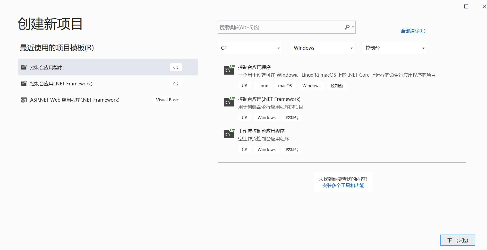
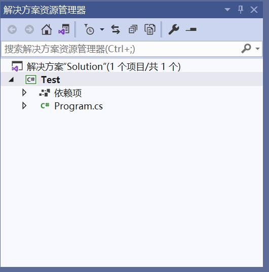
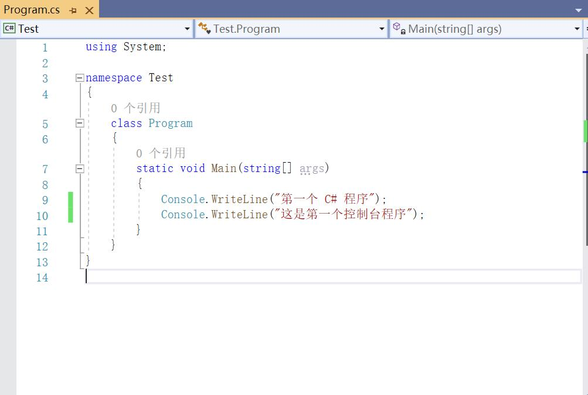
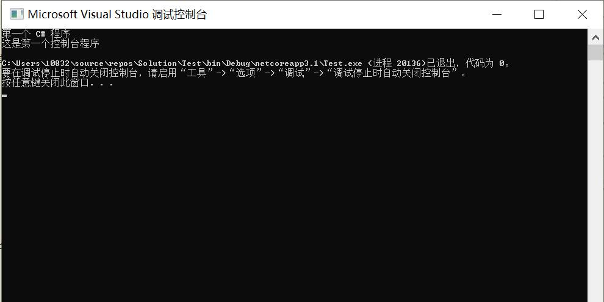

## 本节目标

1. 编写C#控制台程序
2. 了解控制台应用程序文件结构

## 第一个C#程序

了解控制台应用程序通常是认识 C# 应用程序的第一步，它是一个在类似于 DOS 的界面中输入与输出的程序，是学习 C# 程序的基本语法最方便的程序。

接下来我们介绍一下如何创建控制台应用程序。

1. 选择“文件”一“新建”一“项目”命令，弹出如下图所示的对话框。

2. 在其中选择“控制台应用程序”选项，并为该项目设置名称、位置以及解决方案名称，单击“创建”按钮即可创建控制台应用程序，查看效果。

		需要注意解决方案名称不一定与项目名称相同，在同一个解决方案中允许设置多个项目。

3. 第一个控制台程序

从结果显示的界面中可以看出在解决方案资源管理器中创建了一个名为 Solution 的解决方案，并在该解决方案中创建了一个名为 Test 的控制台应用程序。

在 Test 应用程序中包含了一个名为 Program.cs的类文件，该文件中的代码如下图所示。

在该代码中的第 11 行到第 13 行是 Main 方法，Main 方法是一个特殊的方法，并且在每个类中只能有一个，只需要将代码写到 Main 方法中，在项目运行后 Main 方法中的代码就会执行。

在控制台应用 程序的控制台界面中输出内容的方法如下。

		Console.Write();  //向控制台界面不换行输出内容
		Console.WriteLine(); //向控制台界面换行输出内容

下面使用控制台应用程序向控制台输出“第一个 C# 程序”和“这是一个控制台应用程序”，实现的代码如下。

		namespace test		//命名空间的声明
		{
			class Program   //定义类
			{
				static void Main(string[] args)		//主方法，程序的入口
				{
					Console.WriteLine("第一个 C# 程序");	//向控制台界面换行输出内容
					Console.WriteLine("这是第一个控制台程序");//向控制台界面换行输出内容
				}
			}
		}

按 Ctrl+F5 组合键运行程序，查看效果。

关于使用 Console.Write() 方法来完成输出信息的操作请自行尝试并查看运行的效果。

## 代码查看.net版本

		// 工程配置的目标Framework版本
  		Console.WriteLine(AppDomain.CurrentDomain.SetupInformation.TargetFrameworkName); 
		
		// 实际真实运行的Framework版本		   
	 	Console.WriteLine(FileVersionInfo.GetVersionInfo(typeof(Uri).Assembly.Location).ProductVersion);	

## 总结

1. 控制台应用程序文件结构

   > *.sln是解决方案文件---作用是组合多个项目用的
   >
   > csproj是工程文件
   >
   > cs是类文件,即C#源程序文件
   >
   > bin是生成目录---一般默认情况下编译目录生成的地方
   >
   > obj是生成对象目录---调试信息

2. C# 程序主要包括以下部分：

		> 命名空间声明
	> class关键字定义类
	> 类的方法
	> 类的属性
	> 一个 Main 方法
	> 语句& 表达式
	> 注释

3. 注意点

	> C# 是大小写敏感的。
	> 所有的语句和表达式必须以分号（;）结尾
	> 程序的执行从 Main 方法开始。
	> 与 Java 不同的是，文件名可以不同于类的名称。
	
	
## 练习
1.编写一个C#程序输出你的个人信息；

