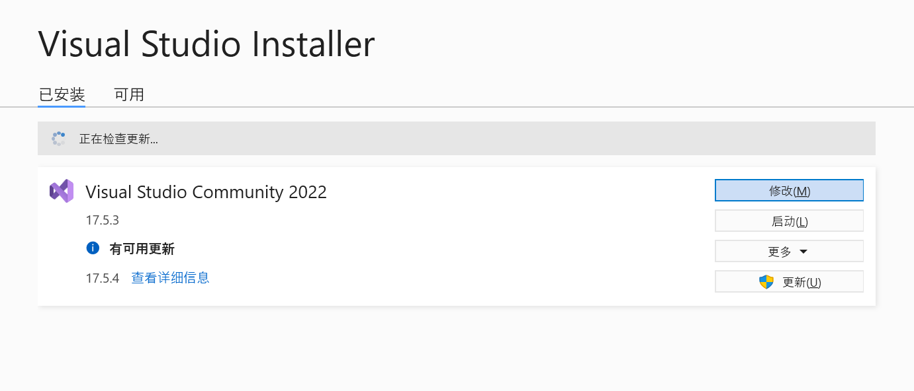
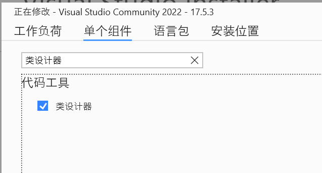

### 查看类图方式

在 Visual Studio 2022 中提供了类图功能，可以将类直接转换成类图的形式。

在开发软件时，经常会在详细设计阶段使用类图的形式来表示类。

在 Visual Studio 2022 中将类文件转换成类图非常简单，直接右击类文件,在右键菜单中选择“查看类图”命令。

效果如下图所示。

1. 最新版本的VS 2022默认是不安装类图查看器的，需要在`Visual Studio Installer`中进行安装。可在开始菜单查找。

2. 选择修改

3. 选择“单个组件”，然后选择代码工具中的“类设计器”，点击修改按钮进行安装；

4. 重启后即可右键的方式查看类图；
