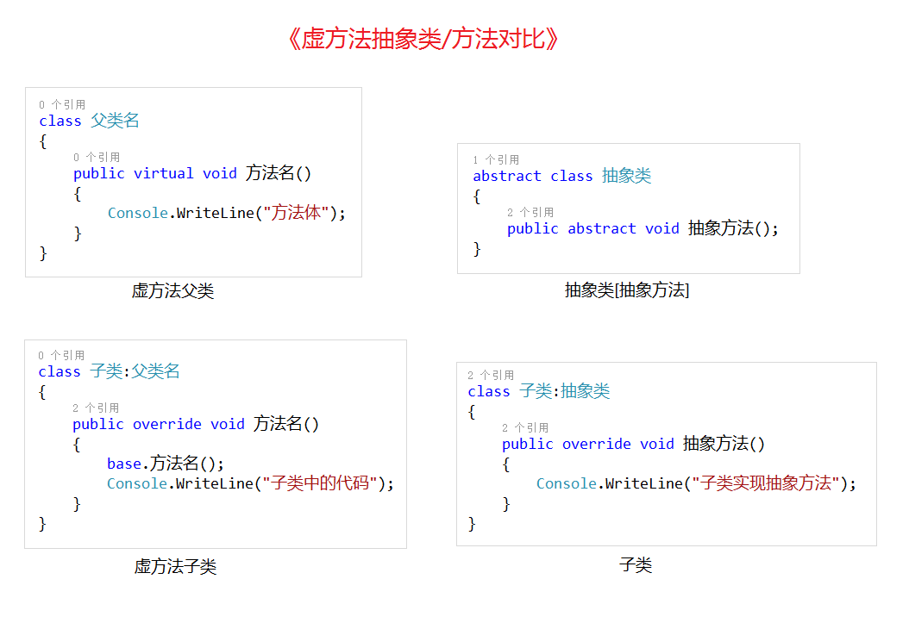

# 多态之抽象类

课程要点：

1.抽象方法 

2.抽象类

3.使用场景


### 一、抽象方法

**1.虚方法 --> 抽象方法**

父类里面用 virtual 关键字修饰的方法叫做虚方法，子类可以使用 override 重新该虚方法，也可以不重写。重不重写，看代码的业务关系和逻辑需要。

虚方法还是有方法体的，方法中可以实现一些准备工作，实现一些共有的功能，方法体中是有一些逻辑代码的。

但是，当我们父类中的这个虚方法已经虚到完全无法确定方法体的时候，或者说，我们完全不知道要做什么，因为有时候就是会这样，需要子类自己去写具体的实现的时候，

就可以使用另外一种形式来表现，这种形式叫抽象方法。


**2.抽象方法语法**

抽象方法的返回值类型前用关键字 **abstract** 修饰，且无方法体。

```c#
	[访问修饰符]  abstract  方法返回值类型  方法名(参数列表);
```

抽象方法必须存在于抽象类中。


### 二、抽象类

**1.抽象类语法**

在定义类的关键字 class 前面加 abstract 修饰的类就是抽象类。

```c#
[访问修饰符]  abstract class  类名
{
	//类成员
}
```


**2. 子类继承抽象类，使用 override 关键字重写父类中所有的抽象方法。**


**3.抽象类注意事项**

<1>抽象类中不一定要有抽象方法，但是**抽象方法必须存在于抽象类中**。

<2>抽象类不能被实例化，因为抽象类中有抽象方法(无方法体)，如果真能实例化抽象类的话，调用这些无方法体的方法是没有任何意义的，所以无法实例化。

<3>子类继承抽象类，必须实现父类中所有的抽象方法；


### 三、使用场景

<1>当父类中的方法**不知道如何去实现**的时候，可以考虑将父类写成抽象类，将方法写成抽象方法。

<2>如果父类中的方法**没有默认实现**，父类也**不需要被实例化**，则可以将该类定义为抽象类。

<3>如果父类中的方法**有默认实现**，并且父类**需要被实例化**，这时可以考虑将父类定义成一个普通类，用虚方法实现多态。


## 多态之抽象类案例


### 一、抽象类编程案例

**1.知识回顾**

<1>关于多态的实现方式已经介绍了**虚方法**，**抽象类**两种方式了。

<2>多态的使用前提，是建立在继承的关系之上的，

​	  也就是说，无论是虚方法，还是抽象类，都必须要先有**继承**关系，然后才会出现多态。

<3>面向对象的封装，继承，多态，都是我们后期**规划代码结构**的**基本思想**。

<4>稍微大点的项目可能会有几百个独立的类文件，这么多的类文件，如果没有一个**代码结构框架**来管理的话，项目十有八九是会中途夭折的。

也就是说，代码一旦多了，你不管理，开发的难度、扩展的难度、维护的难度，就高了。有些时候，就是因为代码太烂了，一个项目就挂掉了，这些都是有可能的。


**2.使用抽象类结构实现NPC 模块**

在游戏中会出现很多种不同用途的 NPC，这些 NPC 有各自的存在的价值和作用，同时又具备一些共性的东西。

在开发 NPC 系统的时候，往往是需要提取共性，独立出一个父类，然后子类继承实现不同作用的 NPC。

分析：任务 NPC，商贩 NPC，铁匠 NPC，三种 NPC 的种类。

共有属性：npc 的名字，npc 的类型；

共有方法：都能和玩家交互(交谈)；


### 二、虚方法抽象类语法对比

对比分析下虚方法和抽象类（抽象方法）的语法格式重点记忆语法格式，特有的关键字。



先掌握语法结构，看到这关键字后，能知道哪个是抽象类，哪个是虚方法。

随着代码量多了了之后，再逐渐理解，逐渐深入。