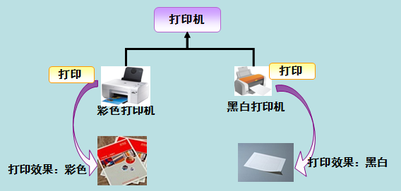

# 多态之接口

课程要点：

 1.定义接口：interface关键字

2.使用接口

## 接口

### 1.抽象类->接口

​	当抽象类中所有的方法都是抽象方法的时候，这个时候可以把这个抽象类用另外一种形式来表现，这种形式叫接口，接口是更加纯粹的	抽象类。

### 2.**什么是接口**

​	接口是一种数据类型，使用关键字interface创建。

### 3.定义接口的语法

​	使用 **interface** 关键字定义，没有 class 关键字

​	接口定义的语法形式如下:

```C#
    interface  接口名称
    {
        接口成员；
    }
```

其中：
	1) 接口名称:
		通常是以 I 开头，再加上其他的单词构成。例如创建一个计算的接口，可以命名为 ICompute。在一堆源文件中通过名字判断，I 开		头的都是接口。

​	2) 接口成员:
​		接口中定义的成员与类中定义的成员类似。接口中定义的成员必须满足以下要求：

```
1. 在接口中不能定义字段，但可以定义属性（用自动属性）。
2. 接口中的成员不允许使用访问修饰符,默认都是public；
3. 接口中定义的方法不能有方法体，全是抽象方法，但又不需要用 abstract 修饰；
```


### 4.接口注意事项

​	<1>接口中所有的方法都是抽象方法，所以接口**不能被实例化**；

​	<2>一个类可以实现多个接口，被实现的多个接口之间用逗号分隔开；

​	<3>一个接口可以继承多个接口，接口之间也要用逗号分隔，就是把多个接口合在一起变成一个新的接口，叫接口绑定。

​	<4>一个类既可以派生自另一个类，还可以同时实现某个接口，一个类继承基类同时又实现接口时，基类名要写在接口名的前面。


### 5.接口的作用


#### 1）实现代码的规范

在日常生活中，手机、笔记本电脑、平板电脑等电子产品，提供了不同类型的接口，用于充电或者连接不同的设备，不同类型接口的标准不一样，例如电压、尺寸等等。

在C#中接口也是定义**一种标准**，如果需要使用接口，必须满足接口中所定义的内容。

一旦定义了一个接口，许多类都可以实现它，但必须与接口的定义**严格一致**。

接口定义了属性、方法和事件，这些都是接口的成员。接口**只包含了成员的声明**。成员的定义是**派生类的责任**。接口提供了派生类**应遵循的标准结构**。

接口使得实现接口的类或结构在形式上**保持一致**。


#### 2）弥补单继承，实现多继承

C#不支持多继承，但是客观世界出现多继承的情况又比较多，为了防止传统的多重继承给程序带来的复杂性等问题，C#提出了接口的概念，我们可以通过接口来实现**多重继承**的功能。

现实中，多继承的例子：

​	舞蹈老师（既是老师，又是舞蹈天赋）

​	音乐老师（既是老师，又有音乐天赋）

解决：

​	父类：老师类（包含了老师共有的一些特征和能力）

​	接口：舞蹈家接口（定义了舞蹈家的一些能力）、音乐家接口（定义了音乐家的一些能力）

​	舞蹈老师继承老师类，实现舞蹈家接口；音乐家继承老师类，实现音乐家的接口。


## 接口的使用

### 1.语法格式

​	1）类继承接口 Class A ： interface B，interface C

​			类需要实现继承接口中所有的方法，支持多继承

​	2）接口继承接口 interface A ：interface B，interface C

​			接口不能实现继承接口的任何方法，支持多继承

​	3）struct结构体可以继承接口，但是不能继承类


### 2.接口的使用场景

接口是一种能力，是一种规范，当我们对现在**已经存在的类的继承关系**进行功能**扩展**的时候，就可以使用接口来完成相应的工作。

```
场景描述：动物有表演大赛，参赛的动物有狮子，老虎，老鹰，小鸟。

分析：
我们可以设计一个基类Animal，有吃饭和睡觉两个方法。

上述四种动物皆继承与Animal。

但是现在问题来了，狮子和老虎会捕猎，老鹰和小鸟会飞，此时该怎么设计呢？

答案是使用接口，一个是捕猎的接口，老虎和狮子继承。一个是飞的接口，老鹰和小鸟继承。
```


### 3.接口中多态的实现


在前面学过多态能使用类之间的继承关系来实现，通过多个类继承同一个接口，并实现接口中的成员也能完成多态的表示。

使用接口实现多态 需要满足以下两个条件。

        定义接口并使用类实现了接口中的成员。
        使用接口定义对象指向实现类的实例

多态就是同一个接口，使用不同的实例而执行不同操作，如图所示：





定义打印接口名称为 IPrint，分别定义两个实现类来实现接口的成员，示例代码如下。

```C#
    interface IPrint
    {
        void print();
    }
    class Test1 : IPrint
    {
        public void methodA()
        {
            Console.WriteLine("Test1 类中的 methodA 方法");
        }
    }
    class Test2 : ITest
    {
        public void methodA()
        {
            Console.WriteLine("Test2 类中的 methodA 方法");
        }
    }
```

使用多态的方式调用实现类中的方法，Main 方法中的代码如下。

```C#
    class Program
    {
        static void Main(string[] args)
        {
            ITest test1 = new Test1();  //创建接口的实例test1指向实现类Test1的对象
            test1.methodA();
            ITest test2 = new Test2();  //创建接口的实例test2指向实现类Test2的对象
            test2.methodA();
        }
    }
```

执行上面的代码，查看效果。

从上面的执行效果可以看出，使用不同类实现同一接口的方法输出的内容各不相同，这就是使用接口的方式实现多态的方法。


### 4.多态之接口案例


**模拟电脑USB接口与外部移动设备的读写关系**

所有的电脑上都有 USB 接口，这些 USB 接口存在的目的是为了方便对电脑进行功能上的扩展，可以在这些接口上插 U 盘，移动硬盘，手机，外置光驱等等。之所以可以在 USB 接口上插入这些外置设备，是因为这些设备的接口都符合USB 接口的协议，符合了这个协议，才能使设备可以正常的和电脑连接。

编码实现：

USB 是一个接口。

U 盘，移动硬盘，手机是具体的产品，这些产品在满足了自身功能的前提后，还需要实现这个 USB 接口规定的功能。


**分析电脑与外部移动设备的关系**


创建1个接口：USB

创建3个类：电脑类、U盘类、移动硬盘类

U盘类和移动类实现USB接口

电脑类定义两个USB接口对象。


**接口作为参数、返回值或类字段，可实现多态**


## **总结：**

1. 接口是抽象的，接口是一组行为的抽象。接口只表达 “能做什么” ， 不表达“如何做什么”

2. 接口是规范，定义一组对外的行为规范。即实现类必须实现接口的所有成员。

3. 接口使用 **interface** 关键字定义。

4. 接口作为参数、返回值或类字段，可实现多态。

    

